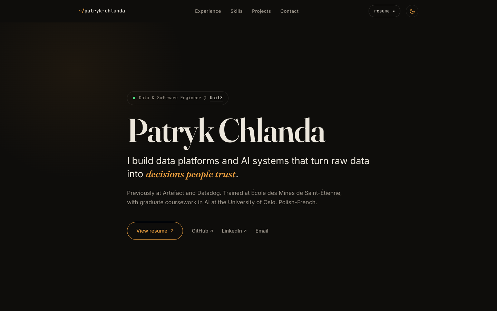
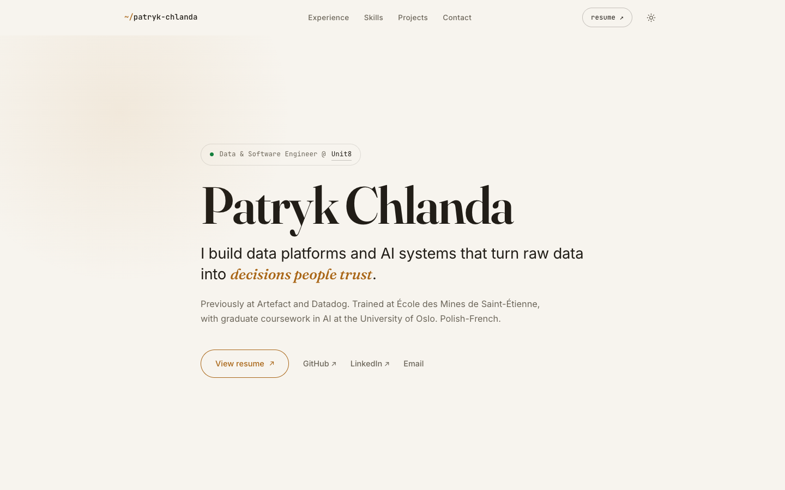

# patrykchlanda.netlify.app

My personal website — hand-built from scratch. No template, no framework, no build step.

**Live: [patrykchlanda.netlify.app](https://patrykchlanda.netlify.app/)**

## Preview

| Dark | Light |
|---|---|
|  |  |

## Under the hood

- **One static page** — `index.html` + `assets/css/style.css` + `assets/js/site.js`. That's the whole site.
- **Typography-led design** — Fraunces (display), Inter (text), JetBrains Mono (labels), with a warm dark/light palette driven by CSS custom properties.
- **~100 lines of vanilla JS** — theme toggle (`localStorage` + `prefers-color-scheme`), IntersectionObserver scroll reveals, and active-section nav highlighting. No jQuery, no dependencies.
- **Accessible & resilient** — semantic HTML, skip link, `:focus-visible` styles, `prefers-reduced-motion` respected, and full content without JavaScript.

## Run locally

```bash
git clone https://github.com/patiwwb/my-personal-website.git
cd my-personal-website
python3 -m http.server 8000   # or just open index.html
```

## Contact

- Email: patrykchlandapro@gmail.com
- LinkedIn: [patryk-chlanda](https://www.linkedin.com/in/patryk-chlanda/)
